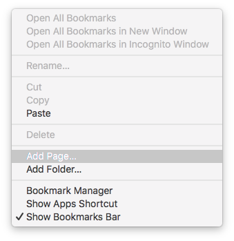

# bookmarkletify [](https://semaphoreci.com/rafaelrinaldi/bookmarkletify)

> Convert JavaScript files to bookmarklets

## Install

Download it to `/usr/local/bin` via [cURL](https://curl.haxx.se):

```sh
$ curl https://raw.githubusercontent.com/rafaelrinaldi/bookmarkletify/master/bookmarkletify > /usr/local/bin/bookmarkletify
```

Compile the binary:

```sh
$ chmod +x /usr/local/bin/bookmarkletify
```

## Requirements

[Node.js](https://nodejs.org) (`>=8`)

## Usage

```
Usage: bookmarkletify <FILE>

  Convert JavaScript files to bookmarklets

Example:
  $ bookmarkletify script.js

Via stdin:
  $ cat script.js | bookmarkletify

Options:
  -h --help                Display software usage
```

### Creating a bookmarklet

To generate a simple bookmarklet for Google Chrome that displays `42` on screen:

```sh
$ # Generate the output and pipe it the system clipboard
$ echo "alert(42);" | bookmarkletify | pbcopy
```

<kbd>Cmd</kbd> <kbd>Shift</kbd> <kbd>b</kbd> to show the bookmarks bar, then right click on it and select "Add Page":



Give your bookmarklet a name and, on the URL field, paste the code we previously generated from the command line:


Now if you click on the bookmarklet you should see the expected result:


## License

MIT © [Rafael Rinaldi](http://rinaldi.io)

---

<p align="center">
  <a href="https://buymeacoff.ee/rinaldi" title="Buy me a coffee">Buy me a ☕</a>
</p>
